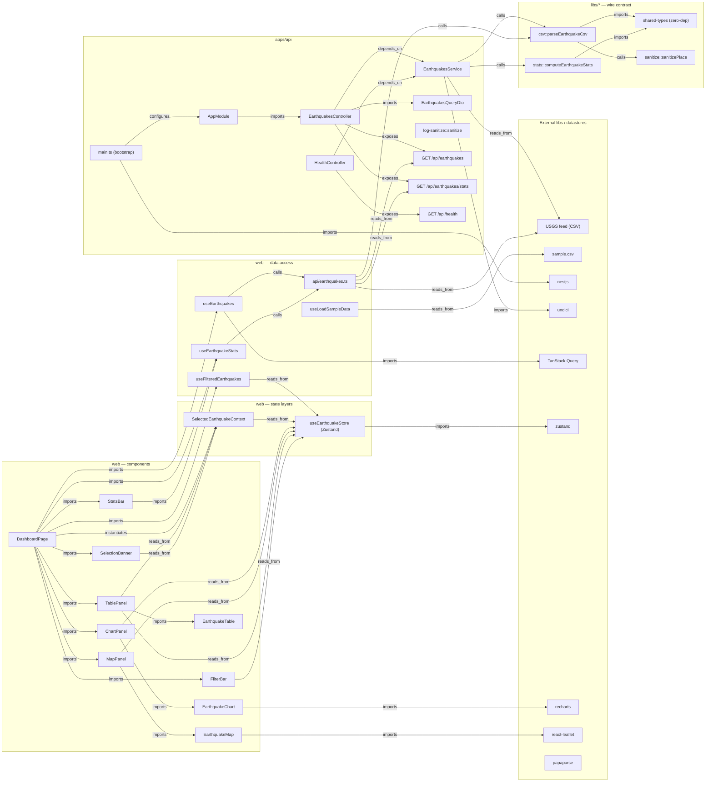

# Knowledge Graph — Atlas Insights

> A compact, machine-maintainable dependency/structure graph of this monorepo, stored as
> triples. The triples are the **source of truth**; the Mermaid diagram is generated on demand
> from them. This file exists so future AI sessions (and humans) can read the architecture in a
> few hundred tokens instead of re-walking every file, and update it cheaply with diffs only.

---

## 1. How to read this

Every fact is a single triple, one per line:

```text
(subject)-[relation]->(object)
```

**Node ids** are canonical, snake_cased, path-based. Same entity ⇒ same id, always.

- Module / file: path-based — `apps/web/src/store/useEarthquakeStore.ts` → `web_store`
- Symbol: `file::name` — `earthquakes_service::list`
- Endpoint: `endpoint_get_earthquakes`

**Node types** (tagged once via `instance_of`):
`module | file | class | function | endpoint | service | config | external_lib | datastore`

**Relations** (closed vocabulary; pick nearest, else `related_to`):
`imports | calls | defines | inherits | implements | depends_on | exposes | reads_from | writes_to | configures | tested_by | instantiates`

**Attributes** (`has_attribute`, high-signal only): `lang`, `loc`, `route`, `layer`.

Scope is **architecture, not every line**: cross-file edges, service/endpoint/datastore wiring,
project-boundary imports. Third-party packages collapse to one `external_lib` node each.

---

## 2. How to render it as a picture

Paste the triple store below into a session and say:

> RENDER: Convert the current triple set into Mermaid `graph LR`.
> - One node per id; label with short name, not full path.
> - Group nodes by `instance_of` type / layer using subgraphs.
> - Edge labels = relation names. Omit `has_attribute` edges; fold attributes into node labels.
> - Output only the mermaid code block.

A pre-rendered diagram is kept in [§5](#5-rendered-diagram-architectural-slice) — regenerate it
whenever the triples change materially.

---

## 3. How to maintain it (diff discipline — the token lever)

When you change the code, **return only new or changed triples**, never the whole store:

- Add / change: emit the triple(s).
- Remove: prefix with a leading minus — `-(subject)-[relation]->(object)`
- No structural change: emit exactly `NO_CHANGES`.

Then fold those deltas into [§4](#4-triple-store-source-of-truth) and bump [§5](#5-rendered-diagram-architectural-slice)
if the picture shifted. Keep the store flat and deduplicated: merge re-spellings to the existing id.

The two biggest size levers: (1) keep edges architectural, not line-level; (2) collapse every npm
package to a single `external_lib` node (`react`, `nestjs`, `tanstack_query`, …) instead of per-symbol.

---

## 4. Triple store (source of truth)

### 4.1 External libs & datastores

```text
(usgs_feed)-[instance_of]->(datastore)
(usgs_feed)-[has_attribute]->(route:GET earthquake.usgs.gov/.../all_month.csv)
(sample_csv)-[instance_of]->(datastore)
(sample_csv)-[has_attribute]->(route:GET /sample.csv)

(react)-[instance_of]->(external_lib)
(react_dom)-[instance_of]->(external_lib)
(zustand)-[instance_of]->(external_lib)
(tanstack_query)-[instance_of]->(external_lib)
(tanstack_table)-[instance_of]->(external_lib)
(tanstack_virtual)-[instance_of]->(external_lib)
(recharts)-[instance_of]->(external_lib)
(react_leaflet)-[instance_of]->(external_lib)
(papaparse)-[instance_of]->(external_lib)
(rxjs)-[instance_of]->(external_lib)
(nestjs)-[instance_of]->(external_lib)
(nestjs_config)-[instance_of]->(external_lib)
(nestjs_cache_manager)-[instance_of]->(external_lib)
(nestjs_throttler)-[instance_of]->(external_lib)
(helmet)-[instance_of]->(external_lib)
(compression)-[instance_of]->(external_lib)
(undici)-[instance_of]->(external_lib)
(class_validator)-[instance_of]->(external_lib)
```

### 4.2 Shared libs (`libs/*`) — the wire contract

```text
(shared_types)-[instance_of]->(module)
(shared_types)-[has_attribute]->(layer:lib-zero-deps)
(shared_types)-[defines]->(shared_types::EarthquakeRecord)
(shared_types)-[defines]->(shared_types::EarthquakeListResponse)
(shared_types)-[defines]->(shared_types::EarthquakeStatsResponse)
(shared_types)-[defines]->(shared_types::HealthResponse)
(shared_types)-[defines]->(shared_types::NumericField)
(shared_types)-[defines]->(shared_types::AXIS_OPTIONS)
(shared_types)-[defines]->(shared_types::DEFAULT_PAGE_SIZE)

(shared_utils_index)-[instance_of]->(module)
(shared_utils_index)-[imports]->(shared_utils_csv)
(shared_utils_index)-[imports]->(shared_utils_sanitize)
(shared_utils_index)-[imports]->(shared_utils_stats)

(shared_utils_csv)-[instance_of]->(file)
(shared_utils_csv)-[imports]->(papaparse)
(shared_utils_csv)-[imports]->(shared_types)
(shared_utils_csv)-[imports]->(shared_utils_sanitize)
(shared_utils_csv)-[defines]->(shared_utils_csv::parseEarthquakeCsv)

(shared_utils_sanitize)-[instance_of]->(file)
(shared_utils_sanitize)-[defines]->(shared_utils_sanitize::sanitizePlace)

(shared_utils_stats)-[instance_of]->(file)
(shared_utils_stats)-[imports]->(shared_types)
(shared_utils_stats)-[defines]->(shared_utils_stats::computeEarthquakeStats)
(shared_utils_stats)-[defines]->(shared_utils_stats::SIGNIFICANT_THRESHOLD)
```

### 4.3 API (`apps/api`)

```text
(api_main)-[instance_of]->(file)
(api_main)-[has_attribute]->(layer:bootstrap)
(api_main)-[imports]->(api_app_module)
(api_main)-[imports]->(nestjs)
(api_main)-[imports]->(nestjs_config)
(api_main)-[imports]->(helmet)
(api_main)-[imports]->(compression)
(api_main)-[imports]->(api_http_exception_filter)
(api_main)-[configures]->(api_app_module)

(api_app_module)-[instance_of]->(module)
(api_app_module)-[imports]->(nestjs_config)
(api_app_module)-[imports]->(nestjs_cache_manager)
(api_app_module)-[imports]->(nestjs_throttler)
(api_app_module)-[imports]->(earthquakes_module)
(api_app_module)-[imports]->(health_module)
(api_app_module)-[imports]->(api_env_validation)
(api_app_module)-[imports]->(api_logging_interceptor)
(api_app_module)-[instantiates]->(api_logging_interceptor)
(api_app_module)-[configures]->(nestjs_throttler)

(api_env_validation)-[instance_of]->(config)
(api_env_validation)-[imports]->(class_validator)
(api_env_validation)-[defines]->(api_env_validation::validateEnv)

(api_log_sanitize)-[instance_of]->(file)
(api_log_sanitize)-[defines]->(api_log_sanitize::sanitize)

(api_http_exception_filter)-[instance_of]->(class)
(api_http_exception_filter)-[has_attribute]->(layer:common-filter)
(api_http_exception_filter)-[imports]->(nestjs)
(api_http_exception_filter)-[imports]->(api_log_sanitize)
(api_http_exception_filter)-[implements]->(nestjs)
(api_http_exception_filter)-[calls]->(api_log_sanitize::sanitize)

(api_logging_interceptor)-[instance_of]->(class)
(api_logging_interceptor)-[has_attribute]->(layer:common-interceptor)
(api_logging_interceptor)-[imports]->(nestjs)
(api_logging_interceptor)-[imports]->(rxjs)
(api_logging_interceptor)-[imports]->(api_log_sanitize)
(api_logging_interceptor)-[calls]->(api_log_sanitize::sanitize)

(earthquakes_module)-[instance_of]->(module)
(earthquakes_module)-[imports]->(earthquakes_controller)
(earthquakes_module)-[imports]->(earthquakes_service)

(earthquakes_controller)-[instance_of]->(class)
(earthquakes_controller)-[imports]->(earthquakes_query_dto)
(earthquakes_controller)-[imports]->(earthquakes_service)
(earthquakes_controller)-[depends_on]->(earthquakes_service)
(earthquakes_controller)-[exposes]->(endpoint_get_earthquakes)
(earthquakes_controller)-[exposes]->(endpoint_get_earthquakes_stats)
(earthquakes_controller)-[calls]->(earthquakes_service::list)
(earthquakes_controller)-[calls]->(earthquakes_service::stats)

(earthquakes_service)-[instance_of]->(service)
(earthquakes_service)-[imports]->(nestjs_cache_manager)
(earthquakes_service)-[imports]->(nestjs_config)
(earthquakes_service)-[imports]->(undici)
(earthquakes_service)-[imports]->(shared_utils_index)
(earthquakes_service)-[imports]->(shared_types)
(earthquakes_service)-[reads_from]->(usgs_feed)
(earthquakes_service)-[calls]->(shared_utils_csv::parseEarthquakeCsv)
(earthquakes_service)-[calls]->(shared_utils_stats::computeEarthquakeStats)
(earthquakes_service)-[defines]->(earthquakes_service::list)
(earthquakes_service)-[defines]->(earthquakes_service::stats)
(earthquakes_service)-[defines]->(earthquakes_service::computeListEtag)

(earthquakes_query_dto)-[instance_of]->(class)
(earthquakes_query_dto)-[imports]->(class_validator)
(earthquakes_query_dto)-[has_attribute]->(layer:dto-pagination-only)

(health_module)-[instance_of]->(module)
(health_module)-[imports]->(earthquakes_module)
(health_module)-[imports]->(health_controller)

(health_controller)-[instance_of]->(class)
(health_controller)-[imports]->(shared_types)
(health_controller)-[imports]->(earthquakes_service)
(health_controller)-[depends_on]->(earthquakes_service)
(health_controller)-[exposes]->(endpoint_get_health)
(health_controller)-[calls]->(earthquakes_service::getCacheState)

(endpoint_get_earthquakes)-[instance_of]->(endpoint)
(endpoint_get_earthquakes)-[has_attribute]->(route:GET /api/earthquakes)
(endpoint_get_earthquakes_stats)-[instance_of]->(endpoint)
(endpoint_get_earthquakes_stats)-[has_attribute]->(route:GET /api/earthquakes/stats)
(endpoint_get_health)-[instance_of]->(endpoint)
(endpoint_get_health)-[has_attribute]->(route:GET /api/health)
```

### 4.4 Web — entry, providers, state layers

```text
(web_main)-[instance_of]->(file)
(web_main)-[imports]->(react_dom)
(web_main)-[imports]->(web_app)

(web_app)-[instance_of]->(file)
(web_app)-[imports]->(web_app_providers)
(web_app)-[imports]->(web_dashboard_page)

(web_app_providers)-[instance_of]->(file)
(web_app_providers)-[imports]->(tanstack_query)
(web_app_providers)-[imports]->(ui_error_boundary)
(web_app_providers)-[instantiates]->(tanstack_query)

(web_store)-[instance_of]->(file)
(web_store)-[has_attribute]->(layer:state-zustand)
(web_store)-[imports]->(zustand)
(web_store)-[imports]->(shared_types)
(web_store)-[defines]->(web_store::useEarthquakeStore)

(web_selected_context)-[instance_of]->(file)
(web_selected_context)-[has_attribute]->(layer:state-context)
(web_selected_context)-[imports]->(react)
(web_selected_context)-[imports]->(shared_types)
(web_selected_context)-[imports]->(web_store)
(web_selected_context)-[reads_from]->(web_store)
(web_selected_context)-[defines]->(web_selected_context::SelectedEarthquakeProvider)
(web_selected_context)-[defines]->(web_selected_context::useSelectedEarthquake)
```

### 4.5 Web — data access (network + TanStack Query)

```text
(web_api_earthquakes)-[instance_of]->(file)
(web_api_earthquakes)-[has_attribute]->(layer:api-no-hooks)
(web_api_earthquakes)-[imports]->(shared_types)
(web_api_earthquakes)-[imports]->(shared_utils_index)
(web_api_earthquakes)-[reads_from]->(endpoint_get_earthquakes)
(web_api_earthquakes)-[reads_from]->(endpoint_get_earthquakes_stats)
(web_api_earthquakes)-[reads_from]->(usgs_feed)
(web_api_earthquakes)-[calls]->(shared_utils_csv::parseEarthquakeCsv)
(web_api_earthquakes)-[calls]->(shared_utils_stats::computeEarthquakeStats)
(web_api_earthquakes)-[defines]->(web_api_earthquakes::fetchEarthquakePage)
(web_api_earthquakes)-[defines]->(web_api_earthquakes::fetchEarthquakeStats)

(web_use_earthquakes)-[instance_of]->(file)
(web_use_earthquakes)-[has_attribute]->(layer:hook-server-state)
(web_use_earthquakes)-[imports]->(tanstack_query)
(web_use_earthquakes)-[imports]->(shared_types)
(web_use_earthquakes)-[imports]->(web_api_earthquakes)
(web_use_earthquakes)-[calls]->(web_api_earthquakes::fetchEarthquakePage)

(web_use_earthquake_stats)-[instance_of]->(file)
(web_use_earthquake_stats)-[imports]->(tanstack_query)
(web_use_earthquake_stats)-[imports]->(shared_types)
(web_use_earthquake_stats)-[imports]->(shared_utils_index)
(web_use_earthquake_stats)-[imports]->(web_api_earthquakes)
(web_use_earthquake_stats)-[calls]->(web_api_earthquakes::fetchEarthquakeStats)
(web_use_earthquake_stats)-[calls]->(shared_utils_stats::computeEarthquakeStats)

(web_use_filtered_earthquakes)-[instance_of]->(file)
(web_use_filtered_earthquakes)-[imports]->(web_store)
(web_use_filtered_earthquakes)-[imports]->(shared_types)
(web_use_filtered_earthquakes)-[reads_from]->(web_store)

(web_use_load_sample_data)-[instance_of]->(file)
(web_use_load_sample_data)-[imports]->(tanstack_query)
(web_use_load_sample_data)-[imports]->(shared_utils_index)
(web_use_load_sample_data)-[imports]->(shared_types)
(web_use_load_sample_data)-[imports]->(web_api_earthquakes)
(web_use_load_sample_data)-[reads_from]->(sample_csv)
(web_use_load_sample_data)-[calls]->(shared_utils_csv::parseEarthquakeCsv)
(web_use_load_sample_data)-[calls]->(shared_utils_stats::computeEarthquakeStats)
```

### 4.6 Web — page composition

```text
(web_dashboard_page)-[instance_of]->(file)
(web_dashboard_page)-[has_attribute]->(layer:page-composition)
(web_dashboard_page)-[imports]->(app_header)
(web_dashboard_page)-[imports]->(chart_panel)
(web_dashboard_page)-[imports]->(map_panel)
(web_dashboard_page)-[imports]->(table_panel)
(web_dashboard_page)-[imports]->(filter_bar)
(web_dashboard_page)-[imports]->(stats_bar)
(web_dashboard_page)-[imports]->(selection_banner)
(web_dashboard_page)-[imports]->(ui_error_state)
(web_dashboard_page)-[imports]->(web_selected_context)
(web_dashboard_page)-[imports]->(web_use_earthquakes)
(web_dashboard_page)-[imports]->(web_use_filtered_earthquakes)
(web_dashboard_page)-[imports]->(web_use_earthquake_stats)
(web_dashboard_page)-[imports]->(web_use_load_sample_data)
(web_dashboard_page)-[imports]->(web_store)
(web_dashboard_page)-[instantiates]->(web_selected_context::SelectedEarthquakeProvider)
```

### 4.7 Web — feature components

```text
(chart_panel)-[instance_of]->(file)
(chart_panel)-[has_attribute]->(layer:container-panel)
(chart_panel)-[imports]->(ui_card)
(chart_panel)-[imports]->(view_selector)
(chart_panel)-[imports]->(web_store)
(chart_panel)-[imports]->(axis_selector)
(chart_panel)-[imports]->(earthquake_chart)
(chart_panel)-[reads_from]->(web_store)

(earthquake_chart)-[instance_of]->(file)
(earthquake_chart)-[has_attribute]->(layer:presentational-memo)
(earthquake_chart)-[imports]->(recharts)
(earthquake_chart)-[imports]->(shared_types)
(earthquake_chart)-[imports]->(util_colors)
(earthquake_chart)-[imports]->(chart_tooltip)

(axis_selector)-[instance_of]->(file)
(axis_selector)-[imports]->(ui_select)
(axis_selector)-[imports]->(shared_types)

(chart_tooltip)-[instance_of]->(file)
(chart_tooltip)-[imports]->(shared_types)
(chart_tooltip)-[imports]->(util_format)
(chart_tooltip)-[imports]->(util_colors)

(map_panel)-[instance_of]->(file)
(map_panel)-[has_attribute]->(layer:container-panel)
(map_panel)-[imports]->(ui_card)
(map_panel)-[imports]->(web_store)
(map_panel)-[imports]->(earthquake_map)
(map_panel)-[imports]->(view_selector)
(map_panel)-[reads_from]->(web_store)

(earthquake_map)-[instance_of]->(file)
(earthquake_map)-[has_attribute]->(layer:presentational-memo)
(earthquake_map)-[imports]->(react_leaflet)
(earthquake_map)-[imports]->(shared_types)
(earthquake_map)-[imports]->(util_colors)

(view_selector)-[instance_of]->(file)
(view_selector)-[imports]->(web_store)

(table_panel)-[instance_of]->(file)
(table_panel)-[has_attribute]->(layer:container-panel)
(table_panel)-[imports]->(ui_card)
(table_panel)-[imports]->(web_store)
(table_panel)-[imports]->(web_selected_context)
(table_panel)-[imports]->(earthquake_table)
(table_panel)-[imports]->(table_pagination)
(table_panel)-[reads_from]->(web_store)
(table_panel)-[reads_from]->(web_selected_context)

(earthquake_table)-[instance_of]->(file)
(earthquake_table)-[has_attribute]->(layer:presentational-memo)
(earthquake_table)-[imports]->(tanstack_table)
(earthquake_table)-[imports]->(tanstack_virtual)
(earthquake_table)-[imports]->(shared_types)
(earthquake_table)-[imports]->(table_columns)

(table_columns)-[instance_of]->(file)
(table_columns)-[imports]->(tanstack_table)
(table_columns)-[imports]->(shared_types)
(table_columns)-[imports]->(util_format)
(table_columns)-[imports]->(util_colors)

(table_pagination)-[instance_of]->(file)
(table_pagination)-[has_attribute]->(layer:presentational-memo)

(stats_bar)-[instance_of]->(file)
(stats_bar)-[imports]->(web_use_earthquake_stats)
(stats_bar)-[imports]->(util_format)

(selection_banner)-[instance_of]->(file)
(selection_banner)-[imports]->(web_selected_context)
(selection_banner)-[imports]->(util_colors)
(selection_banner)-[imports]->(util_format)
(selection_banner)-[reads_from]->(web_selected_context)

(filter_bar)-[instance_of]->(file)
(filter_bar)-[has_attribute]->(layer:container-panel)
(filter_bar)-[imports]->(web_store)
(filter_bar)-[imports]->(util_csv_export)
(filter_bar)-[imports]->(shared_types)
(filter_bar)-[reads_from]->(web_store)

(app_header)-[instance_of]->(file)
(app_header)-[imports]->(react)
```

### 4.8 Web — UI primitives & utils

```text
(ui_card)-[instance_of]->(file)
(ui_select)-[instance_of]->(file)
(ui_skeleton)-[instance_of]->(file)
(ui_empty_state)-[instance_of]->(file)
(ui_error_state)-[instance_of]->(file)
(ui_badge)-[instance_of]->(file)
(ui_error_boundary)-[instance_of]->(class)
(ui_error_boundary)-[inherits]->(react)
(ui_error_boundary)-[imports]->(ui_error_state)

(util_colors)-[instance_of]->(file)
(util_colors)-[defines]->(util_colors::magnitudeStyle)
(util_format)-[instance_of]->(file)
(util_format)-[defines]->(util_format::formatDateTime)
(util_csv_export)-[instance_of]->(file)
(util_csv_export)-[imports]->(papaparse)
(util_csv_export)-[imports]->(shared_types)
(util_csv_export)-[defines]->(util_csv_export::downloadCsv)
```

---

## 5. Rendered diagram (architectural slice)

Generated from §4. UI-primitive and util fan-in edges are trimmed for legibility; the triple store
keeps the full detail.



---

## 6. What the graph confirms about the architecture

These are the invariants the edges enforce (cross-check against
[`.claude/rules/architecture.md`](.claude/rules/architecture.md) before refactoring):

- **The two apps never touch.** No `web_*` node imports an `api_*` node or vice versa. Their only
  shared edges land on `shared_types` / `shared_utils_*` — the wire contract. Keep it that way.
- **`libs/*` import only `libs/*`.** `shared_utils_csv` → `shared_types`, never an app node.
- **One ingestion boundary for upstream text.** Both `earthquakes_service` and `web_api_earthquakes`
  reach `usgs_feed` and run it through `shared_utils_csv::parseEarthquakeCsv` (which calls
  `sanitizePlace`). Stats always go through `shared_utils_stats::computeEarthquakeStats` — the single
  source of the formula.
- **Server data stays in Query, never Zustand.** `web_store` holds only UI state (filters, axes,
  selection id, active view). Records flow through `web_use_earthquakes` → `useFilteredEarthquakes`.
- **Selection is split on purpose.** `web_store` holds the canonical `selectedId`;
  `web_selected_context` resolves it to a record for distant subtrees (`selection_banner`,
  `table_panel`). Don't merge them.
- **Containers concentrate subscriptions.** `*_panel` nodes carry the `reads_from web_store` edges;
  the `*_chart` / `*_map` / `*_table` leaves are `presentational-memo` and take props only.
- **Logging is sanitized centrally.** Every API logger path routes through
  `api_log_sanitize::sanitize`. A new filter/interceptor/guard must add that edge too.

---

_Last full pass: 2026-05-31. Update via the diff discipline in §3 — emit deltas, fold into §4,
bump §5 only when the picture changes._
