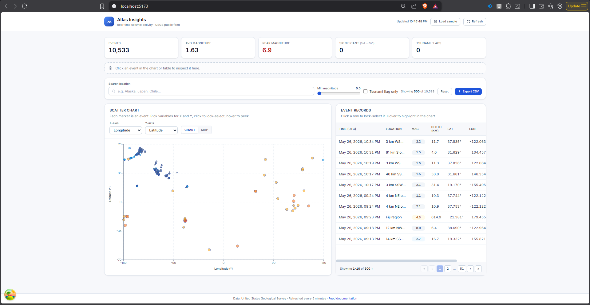

# Atlas Insights

> Nx monorepo containing a **React + TypeScript dashboard** (`apps/web`) and a **NestJS caching & security API** (`apps/api`) that together visualize USGS earthquake data with end-to-end type safety.



---

## Highlights

- **Nx monorepo** with two apps (`web`, `api`) and two shared libs (`shared-types`, `shared-utils`) — strict project boundaries, end-to-end TypeScript paths, single dependency graph.
- **NestJS API layer** in front of the public USGS feed: in-memory cache with TTL and stampede prevention, `@nestjs/throttler` rate limiting, `helmet` security headers, `class-validator` DTOs, untrusted-input sanitization, sanitized error envelope, structured access logs.
- **React dashboard** with bidirectional chart ↔ table sync, a toggleable scatter / world-map view (Recharts + Leaflet), three deliberately-placed state patterns (props / Context / Zustand), virtualized table (TanStack Virtual), polished Tailwind UI.
- **Single source of truth for the wire format** — `EarthquakeRecord` lives in `libs/shared-types` and is imported by both ends.
- **CSV parser shared across the wire** — the API parses upstream, the FE can fall back to direct USGS fetch in "demo mode" without diverging from the API's interpretation.
- **Container + CI pipeline** — multi-stage Dockerfiles for both apps, combined `docker compose` stack with nginx fronting the SPA and reverse-proxying `/api`, GitHub Actions running lint / typecheck / build + image builds on every push.
- Production-grade developer experience: TypeScript strict mode (with `noUncheckedIndexedAccess`), ESLint zero-warning policy, Prettier, env validation, graceful shutdown.

See [`SECURITY.md`](./SECURITY.md) for the full threat model and the controls actually in place.

---

## Workspace layout

```text
atlas-insights/
├── apps/
│   ├── web/                # Vite + React + Tailwind dashboard
│   │   ├── Dockerfile      # multi-stage Vite build → nginx static + reverse proxy
│   │   └── nginx.conf      # SPA fallback + /api proxy + security headers
│   └── api/                # NestJS service: cache, throttle, helmet, validate
│       └── Dockerfile      # multi-stage NestJS build → slim node runtime
├── libs/
│   ├── shared-types/       # EarthquakeRecord, response envelopes, axis enums
│   └── shared-utils/       # CSV parser + sanitization (browser- and node-safe)
├── .github/workflows/      # CI pipeline (lint, typecheck, build, image builds)
├── .claude/                # AI-collaborator rules, commands, agents, skills
├── docker-compose.yml      # Combined web + api stack (nginx fronts SPA + /api proxy)
├── .dockerignore
├── nx.json
├── tsconfig.base.json
├── package.json            # npm workspaces + root scripts
├── CLAUDE.md               # Instructions for AI collaborators
├── INTERVIEWER.md          # Reviewer-facing design rationale & coverage matrix
└── SECURITY.md             # Threat model + control inventory
```

### Data flow (one direction, with the API in the middle)

```text
USGS CSV
   ↓ undici.request (timeout + retry)
apps/api/src/earthquakes/earthquakes.service.ts
   ↓ parseEarthquakeCsv (libs/shared-utils)
   ↓ in-memory cache (5 min TTL, in-flight de-dup)
GET /api/earthquakes (helmet, throttle, validate, sanitize-on-ingest)
   ↓ fetch (apps/web/src/api/earthquakes.ts) — cursor + limit only
   ↓ TanStack Query (useEarthquakes — useInfiniteQuery)
   ↓ useFilteredEarthquakes (Zustand filter slice — client-side filters)
       ├→ ChartPanel  →  EarthquakeChart    (activeView === 'chart')
       ├→ MapPanel    →  EarthquakeMap      (activeView === 'map')
       └→ TablePanel  →  EarthquakeTable
            ↑ Selection / hover loops back via Zustand + Context

Server-computed stats stream in parallel via useEarthquakeStats →
GET /api/earthquakes/stats, both wired through computeEarthquakeStats
in libs/shared-utils so the projection formula has one home.
```

---

## Quick start

### Prerequisites

- **Node 20+** (NestJS 10 + Vite 5 baseline)
- **npm 9+** (uses npm workspaces)

### Install once

```bash
npm install
```

This installs the root toolchain plus both apps and both libs in one pass via npm workspaces.

### Run both apps in parallel (default)

```bash
cp .env.example .env       # optional — defaults work out of the box
npm run dev
```

This starts:

- The NestJS API on <http://localhost:3000/api>
- The React dashboard on <http://localhost:5173>

Vite proxies `/api/*` → `http://localhost:3000/api/*` so the FE has no CORS concerns in development.

### Run just one side

```bash
npm run dev:web    # FE only — defaults to hitting /api (won't work standalone unless...)
npm run dev:api    # API only
```

To run the FE **without** the API (static demo mode), set `VITE_USE_DIRECT_FEED=true` in your `.env` — the FE will fall back to fetching the USGS CSV directly.

### Useful scripts

| Script              | Purpose                                                   |
| ------------------- | --------------------------------------------------------- |
| `npm run dev`       | Both apps in parallel                                     |
| `npm run build`     | Type-check & build API, then web                          |
| `npm run typecheck` | `tsc --noEmit` across both apps                           |
| `npm run lint`      | ESLint zero-warning across both apps                      |
| `npm run format`    | Prettier write                                            |
| `npm run graph`     | Open the Nx project graph in your browser                 |
| `npm run nx -- <…>` | Drop into Nx directly (e.g. `npm run nx -- run web:build`) |

### Run the combined stack with Docker

For a parity-with-prod run (single command, no Node toolchain on host):

```bash
docker compose up --build
open http://localhost:8080
```

What the stack looks like:

- **`api`** — NestJS service from [`apps/api/Dockerfile`](./apps/api/Dockerfile). Multi-stage build (`deps → build → runtime`), runs `node apps/api/dist/main.js` as a non-root user under `tini`. Not port-exposed on the host — only reachable from the `web` service on the internal docker network.
- **`web`** — nginx image from [`apps/web/Dockerfile`](./apps/web/Dockerfile) serving the Vite production bundle and reverse-proxying `/api/*` → `http://api:3000/api/*`. Published on `${WEB_PORT:-8080}`. `VITE_API_BASE_URL=/api` is baked into the bundle so there are no cross-origin hops in production.
- Both services declare healthchecks; `web` waits on `api`'s `/api/health` before accepting traffic.
- Env values fall back to safe defaults; a root `.env` overrides them (`API_CORS_ORIGINS`, `USGS_FEED_URL`, `CACHE_TTL_SECONDS`, `THROTTLE_LIMIT`, etc. — see [`.env.example`](./.env.example)).

To rebuild a single service: `docker compose build web` / `docker compose build api`.

### Continuous integration

Every push and PR runs [`.github/workflows/ci.yml`](./.github/workflows/ci.yml):

1. **`verify`** — `npm ci` → `npm run lint` → `npm run typecheck` → `npm run build`. Node 20, npm cache enabled.
2. **`docker`** (depends on `verify`) — builds both images via Buildx with a GHA layer cache. Images are not pushed — this is a smoke test that the Dockerfiles still produce a runnable artifact.

Concurrency is grouped per-ref so a new push cancels superseded runs.

---

## API surface

| Method | Path                       | Purpose                                                                 | Throttle      |
| ------ | -------------------------- | ----------------------------------------------------------------------- | ------------- |
| GET    | `/api/earthquakes`         | Cursor-paginated `{data, meta}` envelope with `ETag` / `304` support    | 60 / 60 s     |
| GET    | `/api/earthquakes/stats`   | Server-computed summary statistics, also `ETag`-aware                   | global (60 / 60 s) |
| GET    | `/api/health`              | Liveness + cache state, exempt from throttle                            | skip          |

Query parameters on `/api/earthquakes`:

| Param          | Type    | Bounds                                                         |
| -------------- | ------- | -------------------------------------------------------------- |
| `cursor`       | int     | 0–1 000 000 (0-indexed offset for pagination)                  |
| `limit`        | int     | 1–10 000 (page size; default 500 when `cursor` set)            |

Record-level filtering (magnitude, search, tsunami) lives in the FE — the API surface is intentionally pagination-only. Any other key returns a `400` (handled by the global `ValidationPipe`).

### Pagination + cache behaviour

- **Cursor-based pagination.** `?cursor=N&limit=M` returns `data[N : N+M]`, with `meta.nextCursor` set to `N+M` (or `null` when at the end) and `meta.total` set to the full server-side dataset size.
- **Pages are free server-side.** The full parsed dataset lives in one in-memory cache key — every page request is a slice of that array, not a re-parse and never a re-fetch (until the TTL expires).
- **ETag short-circuit.** Each response carries a weak `ETag` derived from `(datasetVersion, cursor, limit)`. On a refresh the client sends `If-None-Match`; if unchanged, the API returns `304 Not Modified` with an empty body. Reloads cost ~200 bytes. Free-text input is intentionally excluded from the key — see [`SECURITY.md`](./SECURITY.md) §3.6.
- **Stampede de-duplication.** Concurrent cache-misses share a single in-flight promise → exactly one upstream USGS call regardless of request volume.

The FE drives this from `useInfiniteQuery`: the first page (500 records) lands in ~200 ms, then subsequent pages auto-stream on a 250 ms idle tick. The chart, table, and stats all progressively fill from the same accumulated array.

---

## External dependencies

### Workspace root

| Package         | Role                                            |
| --------------- | ----------------------------------------------- |
| `nx`            | Monorepo task runner & project graph            |
| `npm-run-all`   | Parallel script orchestration                   |
| `typescript`    | Strict-mode type safety, shared compiler        |
| `eslint`, plugins | Lint + format pipeline                        |
| `prettier`      | Code formatting                                 |

### `apps/web`

| Package                                  | Role                                                   |
| ---------------------------------------- | ------------------------------------------------------ |
| `react`, `react-dom`                     | UI runtime                                             |
| `vite`, `@vitejs/plugin-react`           | Dev server + production bundle, `/api` proxy           |
| `@tanstack/react-query`                  | Server-state caching, retry/backoff                    |
| `@tanstack/react-query-devtools`         | Dev-only query inspector                               |
| `@tanstack/react-table`                  | Headless table model                                   |
| `@tanstack/react-virtual`                | Row windowing for the 10k-row table                    |
| `recharts`                               | Scatter chart                                          |
| `leaflet`, `react-leaflet`               | World-map view + OpenStreetMap tile rendering          |
| `zustand`                                | Global UI state                                        |
| `papaparse`                              | CSV parsing for the direct-feed fallback               |
| `tailwindcss`, `postcss`, `autoprefixer` | Styling                                                |

### `apps/api`

| Package                       | Role                                                          |
| ----------------------------- | ------------------------------------------------------------- |
| `@nestjs/core` + platform-express | App runtime                                               |
| `@nestjs/config`              | Env loader + class-validator schema                           |
| `@nestjs/cache-manager` + `cache-manager` | In-memory cache with TTL                          |
| `@nestjs/throttler`           | Per-IP rate limiter                                           |
| `helmet`                      | Security headers (CSP, X-Frame, HSTS, etc.)                   |
| `compression`                 | Response gzip                                                 |
| `class-validator`, `class-transformer` | DTO validation + safe transforms                     |
| `undici`                      | HTTP client for upstream USGS fetch (timeout-capable)         |
| `reflect-metadata`            | Decorator metadata for class-validator + Nest DI              |

### `libs/shared-utils`

- `papaparse` — only runtime dep; same parser runs on both ends of the wire.
- `computeEarthquakeStats` (pure function, no deps) — server stats route and FE fallback / sample-mode all consume the same projection so the formula has a single home.

---

## State management approach (recap)

| Pattern           | Where                                                                          | Why                                                                                  |
| ----------------- | ------------------------------------------------------------------------------ | ------------------------------------------------------------------------------------ |
| **Props**         | `<EarthquakeChart>`, `<EarthquakeMap>`, `<EarthquakeTable>`, `<AxisSelector>`  | Pure presentational components stay snapshot- and Storybook-friendly                 |
| **React Context** | `SelectedEarthquakeContext`                                                    | Resolves `selectedId` → `EarthquakeRecord` once, shares across distant subtrees      |
| **Zustand**       | `useEarthquakeStore` — filters, axes, `activeView`, `selectedId`, `hoveredId`  | High-frequency cross-cutting UI state; selector subscriptions avoid re-render storms |

The canonical `selectedId` lives in Zustand; the Context derives the resolved record from `(records, selectedId)`. Two sources, single source of truth — see [`INTERVIEWER.md`](./INTERVIEWER.md) for the rationale.

---

## Trade-offs

- **No router.** Single-page dashboard. `pages/` is in place so adding one is non-disruptive.
- **No tests in this submission.** Pure helpers (`csv.ts`, `sanitize.ts`, `stats.ts`, `colors.ts`, `useEarthquakeStats`) are structured for trivial unit testing — see [`INTERVIEWER.md`](./INTERVIEWER.md) §4 for the plan I'd execute next.
- **In-memory API cache.** Survives within a single process. A multi-instance deploy would point `@nestjs/cache-manager` at Redis with a one-line change.
- **Synchronous CSV parsing in the API.** ~10k rows parses in <100 ms. If the feed scaled to 100k+ I'd move it to a worker thread.
- **Client-side filtering in the FE.** Re-runs on each keystroke. At scale we'd debounce the search input and push filter execution server-side (which would also require a filter-aware ETag key and filter-aware totals).

---

## Future improvements

- Marker clustering on the map at low zoom levels (`react-leaflet-cluster`) — pays off once the visible dataset crosses ~2k markers.
- Time-series panel — hourly / daily event bins.
- Redis cache backend for multi-replica API.
- OpenAPI / Swagger doc surface on the API.
- Vitest + Testing Library suites for both apps; Playwright smoke test.
- Service Worker offline cache on the FE.
- Push CI-built images to a registry (GHCR) on tag, gated on the existing `verify` job.

---

## AI usage disclosure

This submission was built with the assistance of an AI pair-programmer (Claude Code). Rather than describe this as "Claude wrote it", the more honest framing is: **I directed an iterative dialogue across design, architecture, implementation, and review phases — the way a senior engineer would direct a capable junior**. The collaboration is documented below at the level of granularity I'd want a reviewer to see.

### 1. Design phase — informed by real production dashboards

Before any code, I walked Claude through a survey of comparable real-time geospatial / scientific-data dashboards to anchor the design in patterns that have already been validated at scale:

- **USGS's own [earthquake.usgs.gov/earthquakes/map](https://earthquake.usgs.gov/earthquakes/map/)** — the canonical reference for this dataset. Their map-first layout with a synced event list informed the **two-panel "visualisation + table" layout** and the **bidirectional selection sync** (clicking on the map highlights the row and vice versa). What I deliberately did *not* copy: their visual density (overwhelming for first-time viewers) and their default time range (too noisy at 7-day window for a portfolio piece).
- **[Volcano Discovery](https://www.volcanodiscovery.com/earthquakes.html)** and **[EMSC's real-time map](https://www.emsc-csem.org/Earthquake/)** — both showed the value of a magnitude → colour ramp encoding consistent across map markers, chart points, and table badges. I lifted the *principle* (one colour scale, three surfaces) into `magnitudeStyle` in `utils/colors.ts`.
- **Observable's [data-table notebooks](https://observablehq.com/)** and **[Datasette](https://datasette.io/)** — both demonstrated discrete pagination + per-row click-to-inspect as a friendlier alternative to infinite scroll for "dataset exploration" UX. This directly informed the choice in [`INTERVIEWER.md` §6](./INTERVIEWER.md#6-performance--pagination) to use discrete pages with auto-jump on chart selection.
- **[Linear](https://linear.app/)** and **[Stripe Dashboard](https://stripe.com/dashboard)** — the visual reference for the muted-slate + accent palette, card density, and segmented control patterns. The brand palette in `tailwind.config.js` was tuned to sit in that neighbourhood without being a copy.
- **[USGS GeoJSON Summary Feed](https://earthquake.usgs.gov/earthquakes/feed/v1.0/summary/)** + the CSV equivalent — I picked CSV deliberately after comparing the two feeds with Claude. CSV is ~40% smaller, parses faster, and the GeoJSON `properties` bag doesn't expose any field we actually use in the dashboard. The trade-off (losing the geometry envelope) was logged before committing to a parser.

These weren't surface-level "looks like X" references — for each, I asked Claude to articulate **what specific pattern they were demonstrating and why it worked**, then decided whether it applied here. That conversation log is the reason the design rationale in `INTERVIEWER.md` reads like decisions rather than aesthetic preferences.

### 2. Architecture phase — theoretical grounding, not just convention

The architectural choices were arrived at by working backwards from CS-level invariants, not by copying a framework template. The full rationale lives in [`INTERVIEWER.md` §2](./INTERVIEWER.md#2-architectural-decisions-worth-calling-out); the short version of *what was discussed* with Claude:

- **State management as a layered cache problem.** I framed FE state to Claude as "four caches with different invalidation rules": props (per-render, parent-controlled), Context (per-subtree, identity-stable), Zustand (per-app, selector-subscribed), TanStack Query (per-key, TTL + revalidation). Each layer was chosen because the *invalidation contract* matched the data's lifetime — server data in Zustand would conflate two contracts, which is why it's forbidden in [`.claude/rules/architecture.md`](./.claude/rules/architecture.md). Reference: **Phil Karlton's "two hard things in computer science"** — naming and cache invalidation. Both apply here.
- **The API as a [thundering-herd mitigator](https://en.wikipedia.org/wiki/Thundering_herd_problem).** I asked Claude to walk through what happens when N concurrent clients hit a cold cache. The answer — a single in-flight promise shared across all callers — is a standard pattern from distributed systems (variations include "request coalescing" in CDNs, "singleflight" in Go's standard idioms, and "promise memoization" in the JS ecosystem). The implementation in `EarthquakesService.fetchAndCache` is a direct application of that principle.
- **ETag/304 as content-addressable caching.** The decision to use weak ETags derived from `(datasetVersion, queryInputs)` is the same idea as a [Merkle-tree hash](https://en.wikipedia.org/wiki/Merkle_tree) at a single level: clients can prove they have the latest version without re-downloading. Discussed with Claude as "what's the minimum bandwidth we need to spend on a reload?" — the answer drove the implementation.
- **Boundary integrity as a [phase-distinction problem](https://en.wikipedia.org/wiki/Phase_distinction).** Static-vs-runtime separation is a recurring theme in type theory. `libs/shared-types` has zero runtime dependencies *by design* — it's the "static phase" artifact that both apps consume. `libs/shared-utils` has runtime code but is framework-agnostic — it's the "runtime phase" artifact that's still safe to import anywhere. Mixing these is what produces the "I imported a server-only module into the browser bundle" class of bug; the lib split prevents it structurally.
- **Throttling as a [token-bucket algorithm](https://en.wikipedia.org/wiki/Token_bucket).** `@nestjs/throttler` is a token-bucket implementation; I asked Claude to confirm the per-IP key derivation (after `trust proxy 1`) was using the correct identifier, since spoofing the bucket key is the most common rate-limit bypass.
- **The CSV parser as a [PEG-style](https://en.wikipedia.org/wiki/Parsing_expression_grammar) deterministic pipeline.** I deliberately did NOT use `papaparse`'s auto-typing in the API path — every field is picked by index and coerced manually, so the parser is deterministic and the failure mode for unexpected input is "null", not "NaN" or "undefined". This is the same defensive-parsing posture you'd see in a real ingest pipeline.

### 3. Implementation phase — directed, not delegated

For every component, module, and service, the conversation pattern with Claude was:

1. **I stated the contract** — what it consumes, what it produces, what invariants it must preserve.
2. **Claude proposed an implementation** — often two or three variants with explicit trade-offs.
3. **I challenged the proposal** — "what happens under N=10000?", "what does this do on a CR/LF in the place name?", "what re-renders when `hoveredId` changes?".
4. **We converged on the chosen approach** — with the reasoning captured either in a docblock or in the corresponding `INTERVIEWER.md` entry so a future reader can reconstruct the decision.
5. **I reviewed every diff** — line by line, for correctness, security, and architectural fit. Diffs that introduced anti-patterns (untyped `any`, server data in Zustand, side effects in render) were rejected and re-iterated.

A concrete example, the **filtering surface** in [`INTERVIEWER.md` §2.5](./INTERVIEWER.md#25-why-filtering-lives-only-on-the-fe): the first proposal was "FE filters only" (simplest), the second was "API filters only" (most scalable), and a middle design briefly shipped both — the same predicate on the API DTO and in the FE's `useFilteredEarthquakes`, FE-active today and API "wired up for tomorrow". That mirror was the [Conway's-law](https://en.wikipedia.org/wiki/Conway%27s_law) drift risk in the flesh: the API copy was never exercised, so it rotted into dead code (an `@IsInt` magnitude that would have rejected the FE's decimal slider, free-text `search` in the ETag key). The follow-up review removed the server-side copy entirely — the API surface is now pagination-only, and the lesson logged in §2.5 is that "wired up for tomorrow" is a liability unless tomorrow's coupled requirements (debounce, filter-aware totals, filter-aware ETag) ship with it.

### 4. Documentation phase — structured outline, then prose

Documentation was the most heavily AI-drafted area, but with a specific workflow:

1. I wrote a **bullet-point outline** of what each file needed to cover — sections, key points, link targets.
2. Claude expanded the outline into prose against the [`.claude/rules/`](./.claude/) writing conventions (terse, decision-first, link liberally, no fluff).
3. I edited every paragraph for accuracy — particularly anywhere a claim could be verified against the code (file paths, env var names, the controls actually present in `main.ts`).
4. The `.claude/` folder itself was co-designed: I described the workflows I wanted to support (review, fix-issue, architecture-check), Claude proposed the rules/commands/agents/skills split, and we iterated on the boundary discipline described in [`INTERVIEWER.md` §2.11](./INTERVIEWER.md#211-why-the-claude-folder-is-structured-the-way-it-is).

### 5. What I explicitly did NOT delegate

- **The decision to add a NestJS API layer** — this changed the scope of the assessment and required a deliberate trade-off discussion (covered in `INTERVIEWER.md` §0). The AI helped articulate the *case*, but the *decision* was mine.
- **The security threat model** in [`SECURITY.md` §1](./SECURITY.md#1-threat-model) — I enumerated the assets and threats; Claude helped map them to controls already present. Every control claim was verified against the code.
- **Dependency selection** — every runtime dependency was justified in the dependency tables. Where Claude proposed a library I hadn't picked (e.g. `react-leaflet-cluster` for marker clustering), I deferred the inclusion to "future improvements" rather than accepting it speculatively.
- **The state-architecture boundaries** (props / Context / Zustand / Query) — Claude proposed alternatives during the design phase; the final four-layer split was my call, anchored in the cache-invalidation framing above.
- **Performance work** in [`INTERVIEWER.md` §6](./INTERVIEWER.md#6-performance--pagination) — the cursor pagination + ETag + idle-prefetch strategy emerged from me explicitly measuring time-to-interactive and asking Claude to propose mitigations for each bottleneck I identified.

### 6. Why this disclosure is structured this way

A reviewer evaluating an AI-assisted submission is implicitly asking two questions: **(a) does the candidate understand the code they're submitting?** and **(b) where did the engineering judgement come from — the human or the model?** I've structured this section to make both questions answerable from the documentation alone, without needing a verbal walkthrough. If any specific decision in this codebase doesn't have a corresponding "why" written down somewhere (in the docblocks, `INTERVIEWER.md`, `SECURITY.md`, or `.claude/rules/`), that's a documentation gap and I'd want to know about it.

---

## Further reading

- [`INTERVIEWER.md`](./INTERVIEWER.md) — design rationale, requirement coverage matrix, testing plan.
- [`SECURITY.md`](./SECURITY.md) — threat model + concrete controls.
- [`CLAUDE.md`](./CLAUDE.md) — repo-level instructions for AI assistants.
- [`.claude/`](./.claude/) — modular rules, commands, agents, skills.

---

Submitted for review · Built with TypeScript end-to-end.
